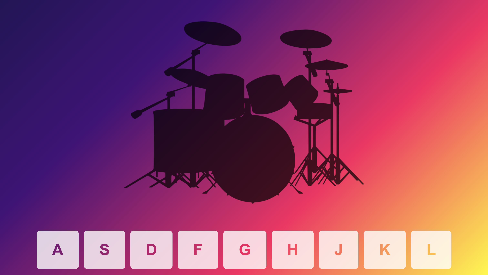

# DURUM KİT
Bu projede klavye tuşlarına basıldığında ses çıkaran bir davul uygulaması yapılmıştır.

## Ekran Görüntüsü

### Canlı Site

## Kullanılan Teknolojiler
- HTML
- CSS
- JavaScript
- Bootstrap
- Google Fonts
- Visual Studio Code

## Yapılanlar
- Klavye tuşlarına basıldığında ses çıkarma
- Tuşa basıldığında tuşun üzerine animasyon eklenmesi
- Tuşa basıldığında sesin çalınması

#### Developer: [Ali Osman UYSAL](https://www.linkedin.com/in/aliosmanuysal/)
