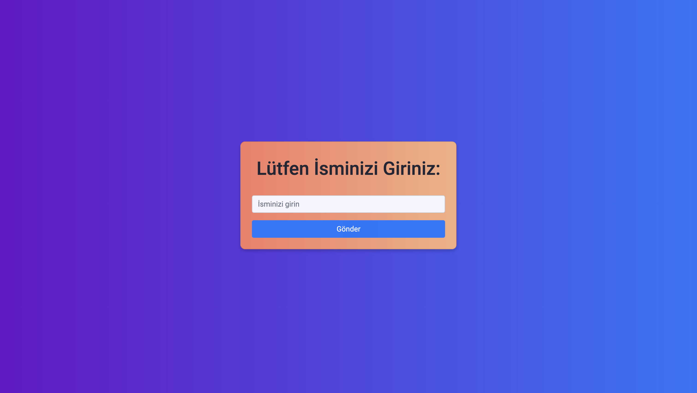
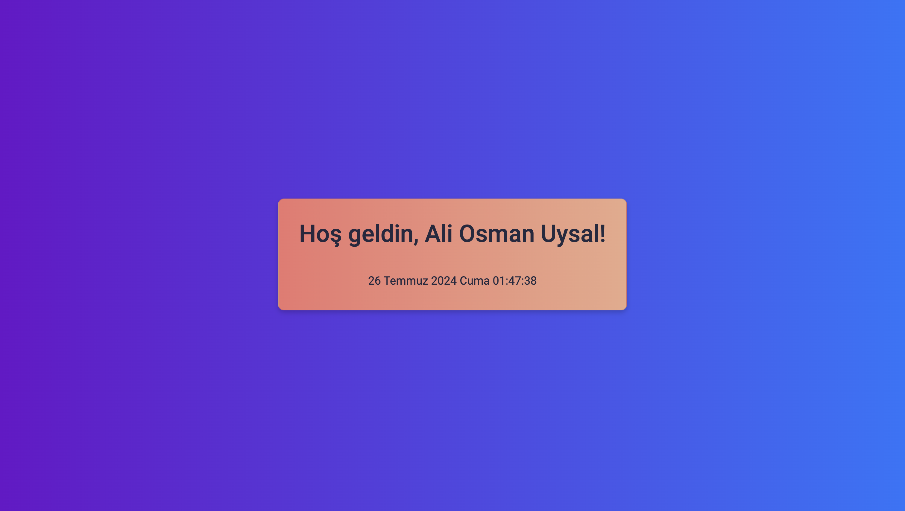

# Karşılama Ekranı Projesi

Bu proje, kullanıcıdan ismini alarak karşılama ekranında kullanıcının ismini ve o anki tarih ve saati gösteren bir web uygulamasıdır. Projede HTML, CSS, JavaScript ve Bootstrap kullanılmıştır. Ayrıca, arka plan ve kartlar için gradyan renkler ve yapıp sönme animasyonu eklenmiştir.

## Proje Yapısı

#### Proje Klasörü
```markdown
│
├── HTML
│   └── index.html
│
├── CSS
│   └── styles.css
│
└── JavaScript
    └── clock.js
```

## Kullanılan Teknolojiler

- HTML
- CSS
- JavaScript
- Bootstrap

## Ekran Görüntüleri

### Giriş Ekranı


### Karşılama Ekranı


## Dosya Açıklamaları

### HTML/index.html
Bu dosya, projenin ana HTML dosyasıdır ve giriş ve karşılama ekranlarını barındırır. Bootstrap kütüphanesi entegre edilmiştir.

### CSS/styles.css

Bu dosya, projenin stil dosyasıdır. Gradyan arka plan ve kartlar ile yapıp sönme animasyonu burada tanımlanmıştır.

### JavaScript/clock.js

Bu dosya, projenin JavaScript dosyasıdır. Kullanıcıdan ismi alır ve karşılama ekranını günceller. Ayrıca, anlık tarih ve saat bilgisini gösterir.

## Özellikler

- Kullanıcıdan isim girişi
- Kullanıcı ismini ve o anki tarih ve saati gösteren karşılama ekranı
- Gradyan arka plan ve kartlar
- Yapıp sönme animasyonu

#### Developer: [Ali Osman UYSAL](https://www.linkedin.com/in/aliosmanuysal/)