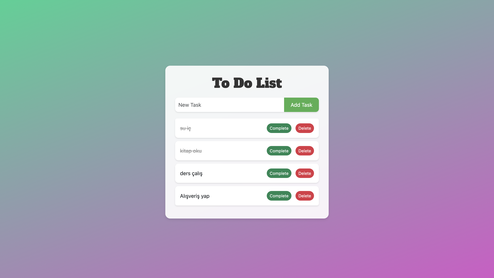

# JAVASCRİPT TO DO LİST

## Description
This is a simple to do list project. You can add, delete and mark as done your tasks.

## Screenshot

## Live Demo

## Technologies Used
- HTML
- CSS
- JavaScript
- Bootstrap
- Google Fonts
- Visual Studio Code

#### Developer: [Ali Osman UYSAL](https://www.linkedin.com/in/aliosmanuysal/)